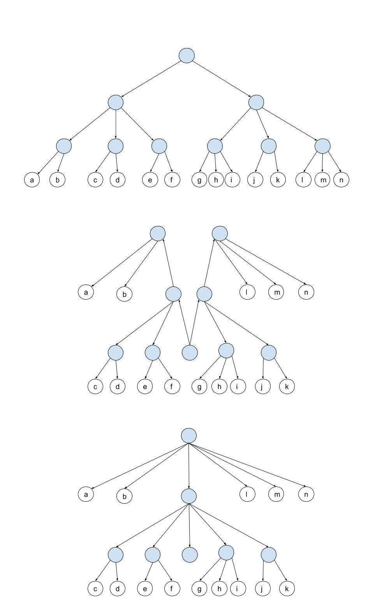

# Finger Trees

An implementation of a [finger tree](https://en.wikipedia.org/wiki/Finger_tree)-backed sequences in
Scala, inspired by Andrew Gibiansky's Haskell
[implementation](https://andrew.gibiansky.com/blog/haskell/finger-trees/).



> A visualization of a finger tree being "pulled down" from a 2-3 tree by Wikipedia user
> [Adityam.rtm](https://commons.wikimedia.org/wiki/File:Finger-tree_from_2-3_tree.jpg)

A finger tree is a purely functional data structure that can serve, among other purposes, as a
performant substitue for arrays or slices in an imperative programming language. Unlike other
functional sequences like linked lists, they don't suffer from linear random access, append, and
concatenation time complexities. Instead, they aim for *amortized*, or average constant-time
operations, which makes them a tempting alternative in situations where more than mere iteration is
desired.

Like the implementation cited above, ours supports the following foundational operations and
respective time complexities (TCs).

| Operation      | Amortized TC (finger tree) | Worst-case TC(finger tree) | Worst-case TC (linked list) |
| ---            | ---                        | ---                        | ---
| append         | O(1)                       | O(log n)                   | O(n)
| concatenate    | O(1)                       | O(log min(n, m))           | O(n + m)
| popLeft        | O(1)                       | O(log n)                   | O(1)
| popRight       | O(1)                       | O(log n)                   | O(n)
| prepend        | O(1)                       | O(log n)                   | O(1)
| split          | O(1)                       | O(log n)                   | O(n)

## Usage Example

```
$ cat Main.scala
import fingertrees.FingerTreeList

class Main extends App {
	println(FingerTreeList(Range(0, 5): _*).concatenate(FingerTreeList(Range(5, 10): _*)))
}

$ scala Main.scala
FingerTreeList(0, 1, 2, 3, 4, 5, 6, 7, 8, 9)
```

See `src/main/scala/fingertrees/FingerTree.scala` for the methods supported by `FingerTreeList`.

## Running the Tests

Follow the steps below to run the tests in `src/test/scala/fingertrees/FingerTree.spec.scala`.

1. Install [SBT](https://www.scala-sbt.org/).
2. `$ git clone https://github.com/jadenPete/FingerTrees.git`
3. `$ cd FingerTrees`
4. `$ sbt test`
